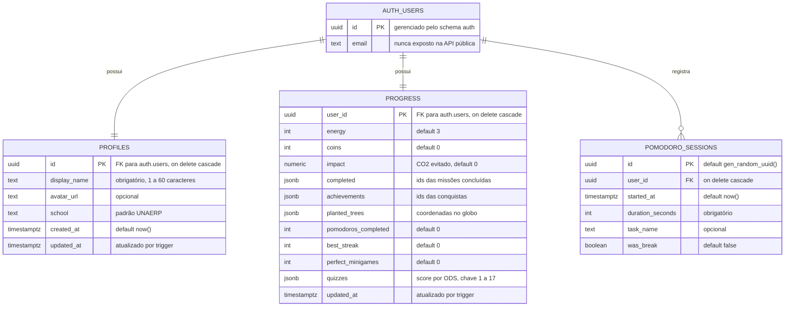
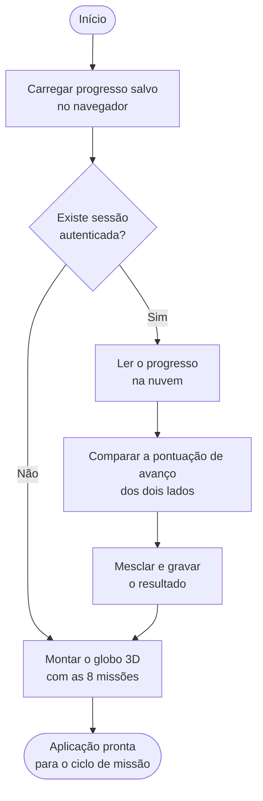
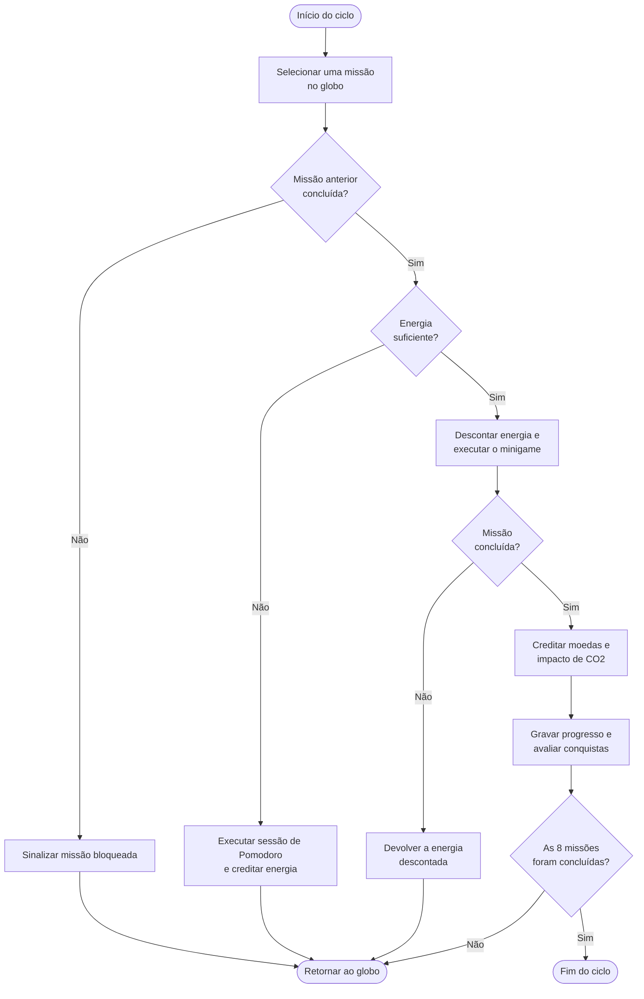
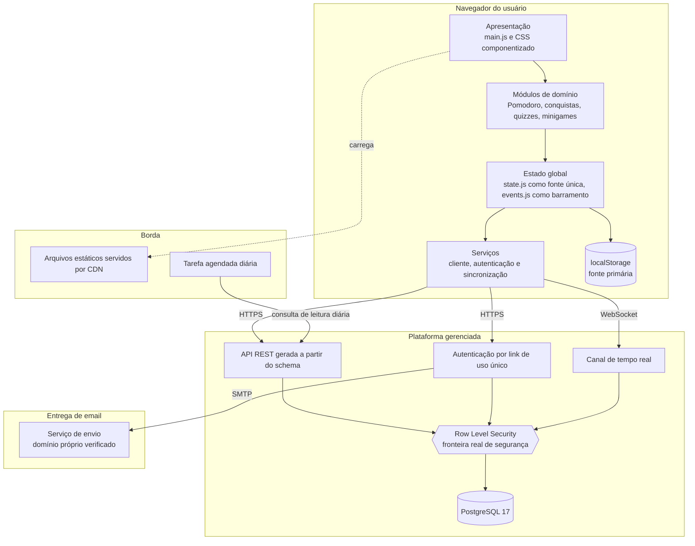
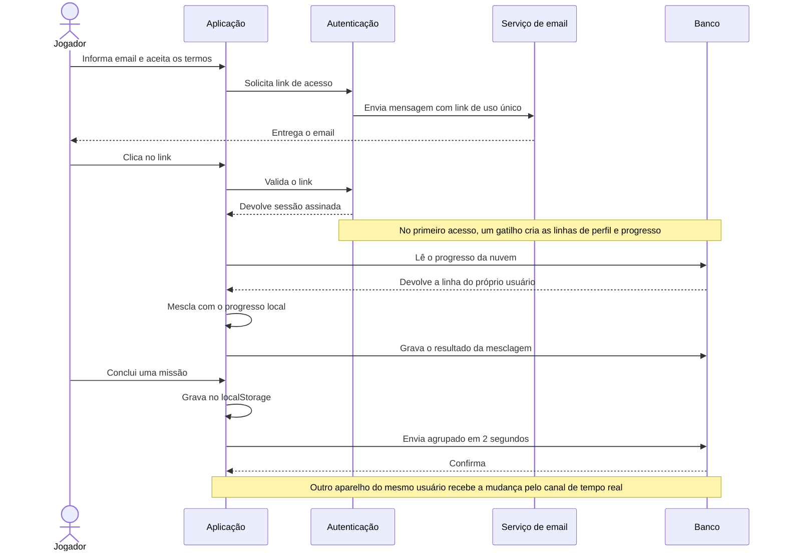
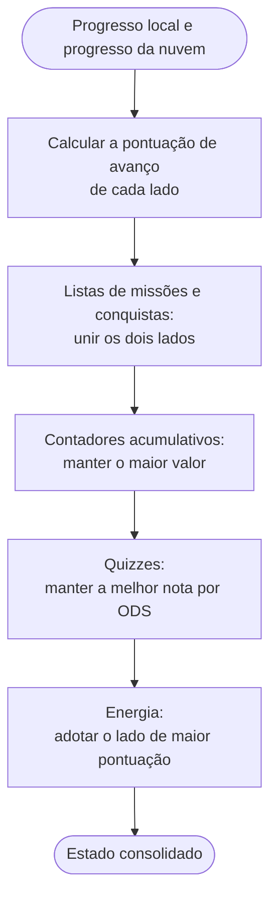

# Diagramas

Seis diagramas, cada um na notação adequada ao que representa. Escritos em Mermaid e versionados como texto, o que permite revisar mudança por mudança no histórico. O GitHub renderiza direto na tela.

Para anexar em documentos, as versões em SVG estão em [`diagramas/`](./diagramas/). Ao alterar um diagrama aqui, regere a imagem correspondente para as duas não divergirem.

| Nº | Nome | Notação |
| --- | --- | --- |
| 1 | Diagrama Entidade-Relacionamento | DER, notação pé de galinha |
| 2 | Fluxograma de inicialização | Fluxograma, ISO 5807 |
| 3 | Fluxograma do ciclo de missão | Fluxograma, ISO 5807 |
| 4 | Diagrama de implantação e componentes | UML, adaptado |
| 5 | Diagrama de sequência | UML 2.5 |
| 6 | Fluxograma de consolidação de progresso | Fluxograma, ISO 5807 |

## 1. Diagrama Entidade-Relacionamento

Modelo extraído do banco em produção, não do arquivo de criação, então reflete o que existe de fato.

São quatro entidades no diagrama, mas apenas **três tabelas são do projeto**: `profiles`, `progress` e `pomodoro_sessions`, todas no schema `public`. A quarta, `auth.users`, pertence ao schema gerenciado pela plataforma de autenticação e aparece porque é a origem das chaves estrangeiras. Sem ela o diagrama ficaria com relacionamentos soltos.

Todas as chaves estrangeiras usam exclusão em cascata. Apagar o usuário elimina perfil, progresso e histórico no mesmo instante, que é o que sustenta na prática o direito de eliminação previsto na LGPD.

Duas decisões de modelagem merecem registro. Primeira: coleções como missões concluídas e conquistas ficam em `jsonb` em vez de tabelas associativas, porque são sempre lidas junto com o restante do progresso e nunca consultadas isoladamente. Segunda: `profiles` e `progress` têm chave primária igual à chave estrangeira, o que garante no nível do banco que existe no máximo uma linha por usuário, sem precisar de restrição adicional.

## 2. Fluxograma de inicialização

Da abertura da página até a aplicação ficar pronta para uso.

## 3. Fluxograma do ciclo de missão

O laço principal do jogo. Foi separado da inicialização de propósito: reunir os dois em um único fluxograma produzia um diagrama com quatro retornos cruzando a página, ilegível.

## 4. Diagrama de implantação e componentes

Agrupa os componentes pelo ambiente em que executam. O cliente é estático e a fronteira de segurança fica no banco, não no navegador: como o código do cliente é público por natureza, ele nunca é tratado como confiável.

## 5. Diagrama de sequência

Do primeiro acesso até o progresso aparecer em um segundo aparelho.

## 6. Fluxograma de consolidação de progresso

O ponto mais delicado da sincronização é decidir qual versão vale quando o jogador avançou em dois aparelhos. A decisão não usa horário, porque relógio de dispositivo e carimbo de banco divergem com facilidade. Em vez disso, o sistema calcula uma pontuação de avanço que só cresce, atribuindo peso maior ao que é difícil de obter.

A pontuação pesa missão concluída acima de sessão de foco, que pesa acima de quiz respondido, e por último conquistas, moedas e árvores. O resultado é determinístico: dois aparelhos que recebem os mesmos dados chegam ao mesmo estado, independentemente da ordem em que sincronizam.
